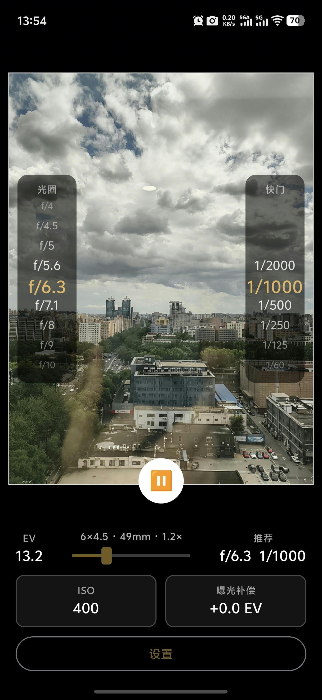
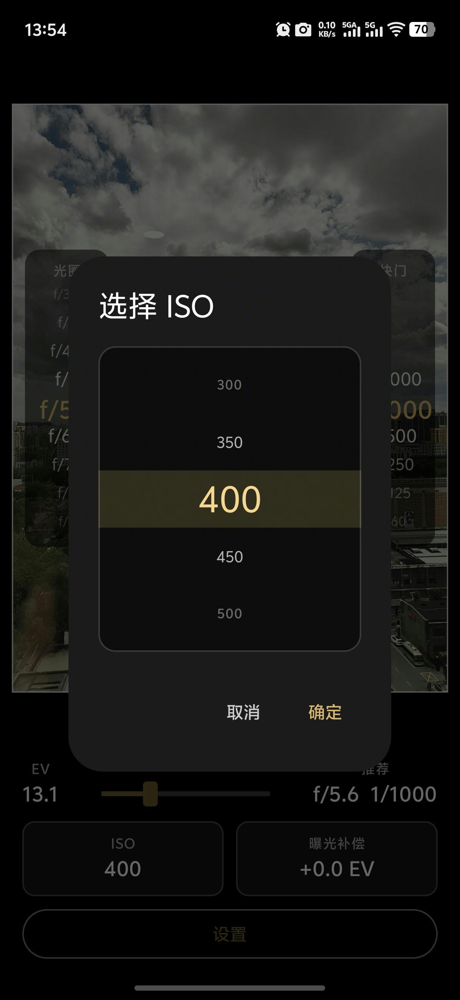
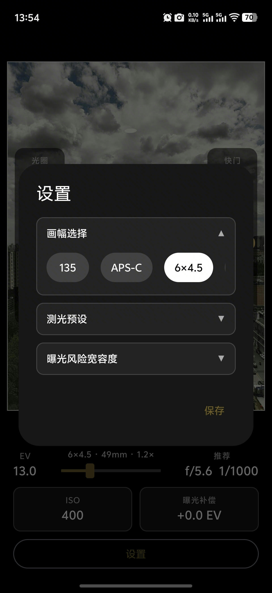
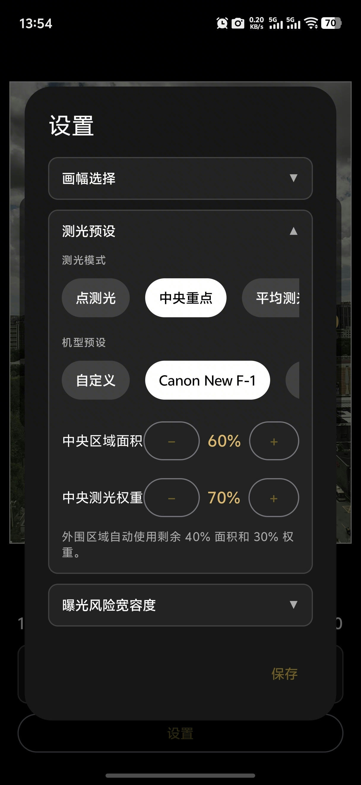
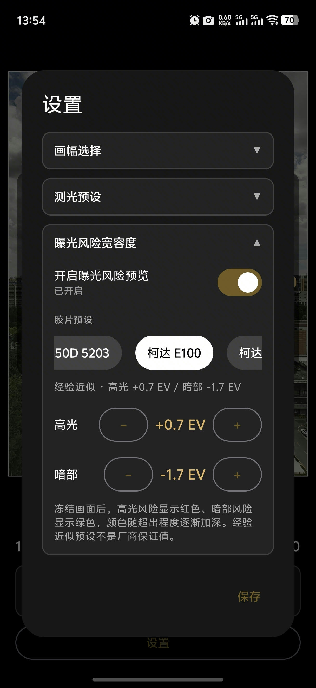
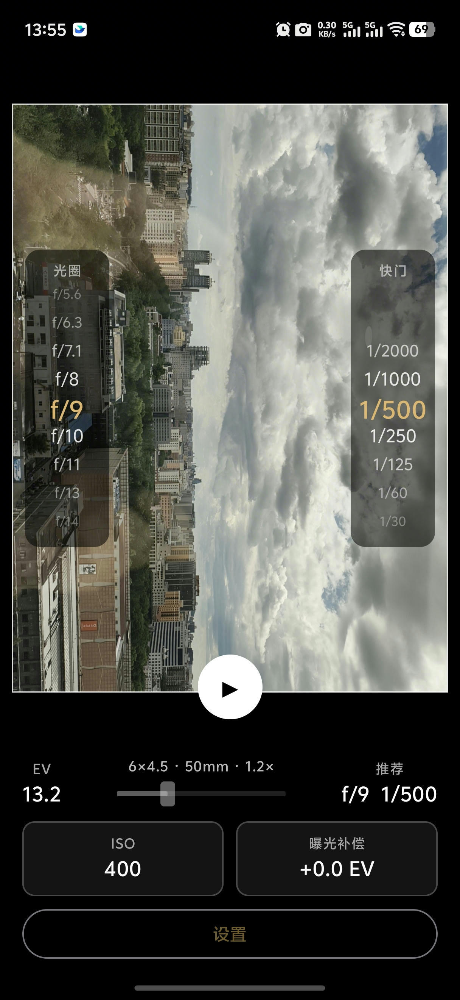
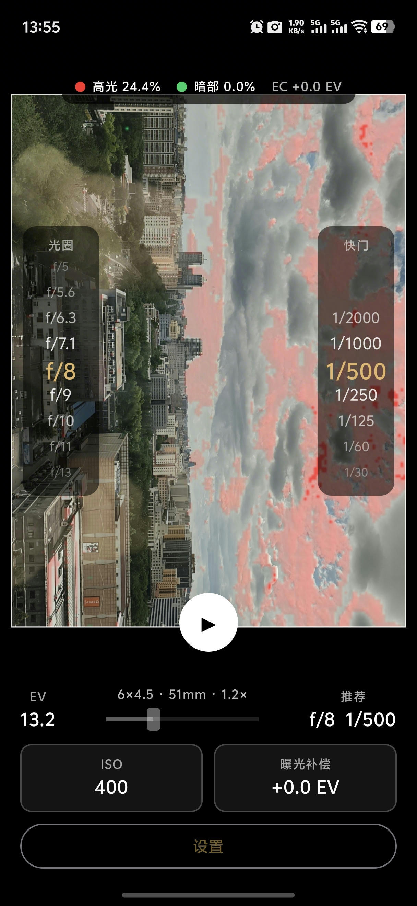

# FilmLightMeter 使用说明书

FilmLightMeter 是一款面向胶片摄影的 Android 反射式测光工具。它通过手机
相机估算场景 EV，给出光圈与快门组合，并可按胶片宽容度标记可能丢失细节的
高光和暗部区域。

## 0. 激活应用

FilmLightMeter 需要输入激活码才能使用。激活码由开发者根据您的设备 ID 生成。

### 0.1 激活步骤

1. 首次启动 App 时，会进入激活页面。
2. 页面显示您的 **16 位设备 ID**（如 `ABBF 0883 E57D E7A0`）。
3. 点击设备 ID 旁的复制按钮，将其发送给开发者。
4. 开发者会返回一个 **激活码**（格式为 `XXXX-XXXX-XXXX-XXXX`）。
5. 在 App 中输入激活码，点击 **激活**。

激活成功后，App 会进入主界面。之后重启 App 无需再次激活。

### 0.2 注意事项

- 激活码与设备绑定，无法在其他设备上使用。
- 更换手机或恢复出厂设置后，需重新申请激活码。
- 激活码仅支持 16 位十六进制字符（0–9, A–F），不区分大小写。

## 1. 快速开始

1. 首次启动时允许相机权限。
2. 点击 `ISO`，选择当前胶片的标称 ISO。
3. 打开 `设置`，选择胶片画幅、测光模式和胶片宽容度预设，然后点击 `保存`。
4. 调整焦段滑块，使取景框接近实际相机和镜头的构图。
5. 将手机对准场景，读取右下角的推荐光圈和快门。
6. 点击画面下方的暂停按钮冻结画面，查看曝光风险。

> FilmLightMeter 使用手机相机进行反射式测光。手机应朝向被摄场景，而不是
> 朝向光源或摄影者。

## 2. 主界面

主界面由取景与测光区、曝光组合区和参数区组成。

### 2.1 取景与测光区

- 白色边框表示当前画幅和焦段对应的有效取景范围。
- 取景框外的内容不参与测光和曝光风险统计。
- 点击画面任意位置可临时切换为点测光，测量点击位置附近的区域。
- 临时点测光后，可通过画面下方出现的恢复按钮回到设置中的测光预设。

### 2.2 光圈与快门候选

画面左侧是光圈候选列表，右侧是快门候选列表。金色项目是当前推荐组合。

- 在光圈列表上上下拖动，可固定偏好的光圈并匹配最接近的快门。
- 在快门列表上上下拖动，可固定偏好的快门并匹配最接近的光圈。
- 推荐组合优先保证曝光误差，再考虑手持安全快门。

### 2.3 底部参数

- `EV`：当前场景的测光结果，以 EV100 表示。
- `画幅 · 焦段 · 倍率`：当前模拟画幅、目标焦段和手机实际变焦倍率。
- `推荐`：结合测光值、胶片 ISO 和曝光补偿计算出的光圈/快门组合。
- `ISO`：当前胶片感光度。
- `曝光补偿`：对推荐曝光进行有意增减，范围为 `-3 EV` 至 `+3 EV`。

拖动焦段滑块时，界面会保留上一次稳定的 EV 和推荐组合；相机倍率稳定后，
再自动替换为新焦段下的测光结果。

## 3. 设置 ISO

点击主界面的 `ISO` 卡片打开选择器：

1. 上下滑动数值滚轮。
2. 将目标 ISO 移到中央金色区域。
3. 点击 `确定`。

ISO 会影响推荐光圈和快门，但不会改变场景本身的 EV100 测量值。使用迫冲或
降感冲洗时，应填写实际用于曝光计算的有效 ISO。

## 4. 曝光补偿

点击主界面的 `曝光补偿` 卡片可选择 EC。正补偿增加曝光，负补偿减少曝光：

- `+1 EV`：曝光量增加一档。
- `-1 EV`：曝光量减少一档。
- 调整步进为 `1/3 EV`。

常见场景参考：

- 雪景、白墙或大面积浅色主体：通常需要正补偿。
- 夜景、黑色背景或大面积深色主体：通常需要负补偿。
- 最终补偿量仍应根据主体和创作意图决定。

## 5. 画幅与焦段

在 `设置 > 画幅选择` 中选择实际使用的胶片画幅：

- `135`
- `APS-C`
- `6×4.5`
- `6×6`

焦段候选范围为 `20–150 mm`。进入专业界面或切换画幅后，FilmLightMeter 会
结合手机相机的传感器尺寸和实际可达变焦倍率，自动收缩为当前画幅可模拟的
焦段范围，因此滑块上下限会随画幅和设备变化。

## 6. 测光模式

在 `设置 > 测光预设` 中可选择：

### 6.1 点测光

读取画面中心的小区域。也可以直接点击取景画面，将测光点移动到主体位置。
点测光面积可在设置中调整。

### 6.2 中央重点

中央区域使用较高权重，外围区域使用剩余权重。适合主体位于画面中央的大多数
日常场景。

可调整：

- 中央区域面积。
- 中央测光权重。

### 6.3 平均测光

对整个有效取景框进行平均，不额外强调中央区域。适合亮度分布比较均匀的场景。

### 6.4 机型预设

内置的机型预设用于模拟部分胶片相机的中央重点测光特性。选择 `自定义` 后，
可手动调整中央区域面积和权重。

## 7. 曝光风险宽容度

在 `设置 > 曝光风险宽容度` 中可以：

- 开启或关闭曝光风险预览。
- 选择胶片预设。
- 手动调整高光和暗部宽容度。

胶片预设会填入对应的高光、暗部参考值。标记为“经验近似”的数据不是厂商
保证值，实际结果还会受到冲洗、扫描和后期处理影响。

自定义阈值时：

- `高光 +N EV`：相对测光参考值高出 N 档后进入高光候选。
- `暗部 -N EV`：相对测光参考值低出 N 档后进入暗部候选。

点击设置对话框底部的 `保存` 后，画幅、测光参数、风险预设、ISO、曝光补偿
和焦段会保存到本机，下次启动时自动恢复。

## 8. 冻结画面与风险预览

### 8.1 冻结画面

点击取景画面下方的暂停按钮：

1. FilmLightMeter 保存当前画面和同一帧测光数据。
2. 根据画面中的风险候选，按需采集增曝光或减曝光探测帧。
3. 探测完成后绘制风险蒙层。

冻结后按钮变为播放图标。点击播放图标可恢复实时测光。

### 8.2 风险颜色

- 红色：高光区域可能因曝光过度而丢失细节。
- 绿色：暗部区域可能因曝光不足而丢失细节。
- 顶部图例显示高光比例、暗部比例和当前 EC。
- 颜色越深，表示超出所选宽容度阈值越多。

算法会额外使用约 `-2 EV` 和 `+2 EV` 探测帧判断是否出现新纹理，以减少
纯白墙面、白纸、黑色头发或黑色背包等固有明暗物体的误报。探测通常需要短暂
等待；手持晃动和运动主体可能影响结果。

冻结状态下仍可调整曝光补偿。风险蒙层会基于同一冻结画面重新计算，方便比较
不同曝光方案。

## 9. 推荐使用流程

对于普通胶片拍摄，建议按以下顺序操作：

1. 设置胶片 ISO 和画幅。
2. 选择胶片宽容度预设。
3. 使用中央重点测光观察整体场景。
4. 点击主体、亮部和暗部分别进行点测光比较。
5. 根据创作意图设置曝光补偿。
6. 从候选列表选择需要的景深或快门速度。
7. 冻结画面检查高光和暗部风险。
8. 将最终光圈和快门设置到胶片相机上。

## 10. 使用限制

- 手机输出的是经过 ISP、HDR 和 tone mapping 处理的 YUV 预览，不等同于 RAW
  测量。
- 曝光风险是辅助判断，不是胶片特性曲线或最终扫描效果的精确模拟。
- 手机镜头污渍、玻璃反光、逆光眩光和屏幕反射会影响测光。
- 极暗环境可能受到手机相机噪声和自动曝光上限影响。
- 建议首次使用时与可信测光表或已校准相机进行对照测试。

## 11. 常见问题

### 为什么变焦时 EV 暂时不变化？

变焦过程中显示的是上一轮稳定结果，避免界面闪烁。实际倍率稳定后才接受新
倍率对应的分析帧。

### 为什么纯黑或纯白区域没有风险颜色？

FilmLightMeter 会比较探测帧中的局部纹理。若增减曝光后仍没有出现新细节，
算法会将其视为固有纯黑或纯白区域并抑制提示。

### 为什么冻结后风险图不是立即出现？

应用可能需要等待手机相机完成探测曝光。只有一侧存在风险候选时通常更快；
高光和暗部候选同时存在时，需要依次采集两张探测帧。

### 为什么推荐值和胶片相机内置测光不同？

两者可能使用不同的测光区域、权重、校准值和镜头透光率。请确认 ISO、曝光
补偿、画幅和测光模式一致，再进行对照。
